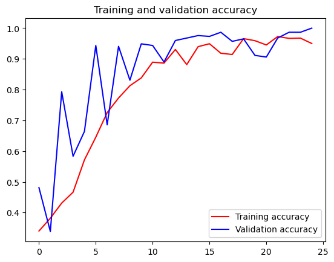

# TensorFlow训练石头剪刀布数据集


解压下载的数据集


```python
import os
import zipfile

local_zip = 'C:/Users/86188/Downloads/rps.zip'
zip_ref = zipfile.ZipFile(local_zip, 'r')
zip_ref.extractall('C:/Users/86188/Downloads/')
zip_ref.close()

local_zip = 'C:/Users/86188/Downloads/rps-test-set.zip'
zip_ref = zipfile.ZipFile(local_zip, 'r')
zip_ref.extractall('C:/Users/86188/Downloads/')
zip_ref.close()
```

检测数据集的解压结果，打印相关信息。


```python
rock_dir = os.path.join('C:/Users/86188/Downloads/rps/rock')
paper_dir = os.path.join('C:/Users/86188/Downloads/rps/paper')
scissors_dir = os.path.join('C:/Users/86188/Downloads/rps/scissors')

print('total training rock images:', len(os.listdir(rock_dir)))
print('total training paper images:', len(os.listdir(paper_dir)))
print('total training scissors images:', len(os.listdir(scissors_dir)))

rock_files = os.listdir(rock_dir)
print(rock_files[:10])

paper_files = os.listdir(paper_dir)
print(paper_files[:10])

scissors_files = os.listdir(scissors_dir)
print(scissors_files[:10])

```

    total training rock images: 840
    total training paper images: 840
    total training scissors images: 840
    ['rock01-000.png', 'rock01-001.png', 'rock01-002.png', 'rock01-003.png', 'rock01-004.png', 'rock01-005.png', 'rock01-006.png', 'rock01-007.png', 'rock01-008.png', 'rock01-009.png']
    ['paper01-000.png', 'paper01-001.png', 'paper01-002.png', 'paper01-003.png', 'paper01-004.png', 'paper01-005.png', 'paper01-006.png', 'paper01-007.png', 'paper01-008.png', 'paper01-009.png']
    ['scissors01-000.png', 'scissors01-001.png', 'scissors01-002.png', 'scissors01-003.png', 'scissors01-004.png', 'scissors01-005.png', 'scissors01-006.png', 'scissors01-007.png', 'scissors01-008.png', 'scissors01-009.png']
    

各打印两张石头剪刀布训练集图片


```python
%matplotlib inline

import matplotlib.pyplot as plt
import matplotlib.image as mpimg

pic_index = 2

next_rock = [os.path.join(rock_dir, fname) 
                for fname in rock_files[pic_index-2:pic_index]]
next_paper = [os.path.join(paper_dir, fname) 
                for fname in paper_files[pic_index-2:pic_index]]
next_scissors = [os.path.join(scissors_dir, fname) 
                for fname in scissors_files[pic_index-2:pic_index]]

for i, img_path in enumerate(next_rock+next_paper+next_scissors):
  #print(img_path)
  img = mpimg.imread(img_path)
  plt.imshow(img)
  plt.axis('Off')
  plt.show()

```


    

    


    

    


    

    


    

    


    

    


    

    


调用TensorFlow的keras进行数据模型的训练和评估。


```python
import tensorflow as tf
import keras_preprocessing
from keras_preprocessing import image
from keras_preprocessing.image import ImageDataGenerator


TRAINING_DIR = "C:/Users/86188/Downloads/rps/"
training_datagen = ImageDataGenerator(
      rescale = 1./255,
	    rotation_range=40,
      width_shift_range=0.2,
      height_shift_range=0.2,
      shear_range=0.2,
      zoom_range=0.2,
      horizontal_flip=True,
      fill_mode='nearest')

VALIDATION_DIR = "C:/Users/86188/Downloads/rps-test-set/"
validation_datagen = ImageDataGenerator(rescale = 1./255)

train_generator = training_datagen.flow_from_directory(
	TRAINING_DIR,
	target_size=(150,150),
	class_mode='categorical',
  batch_size=126
)

validation_generator = validation_datagen.flow_from_directory(
	VALIDATION_DIR,
	target_size=(150,150),
	class_mode='categorical',
  batch_size=126
)

model = tf.keras.models.Sequential([
    # Note the input shape is the desired size of the image 150x150 with 3 bytes color
    # This is the first convolution
    tf.keras.layers.Conv2D(64, (3,3), activation='relu', input_shape=(150, 150, 3)),
    tf.keras.layers.MaxPooling2D(2, 2),
    # The second convolution
    tf.keras.layers.Conv2D(64, (3,3), activation='relu'),
    tf.keras.layers.MaxPooling2D(2,2),
    # The third convolution
    tf.keras.layers.Conv2D(128, (3,3), activation='relu'),
    tf.keras.layers.MaxPooling2D(2,2),
    # The fourth convolution
    tf.keras.layers.Conv2D(128, (3,3), activation='relu'),
    tf.keras.layers.MaxPooling2D(2,2),
    # Flatten the results to feed into a DNN
    tf.keras.layers.Flatten(),
    tf.keras.layers.Dropout(0.5),
    # 512 neuron hidden layer
    tf.keras.layers.Dense(512, activation='relu'),
    tf.keras.layers.Dense(3, activation='softmax')
])


model.summary()

model.compile(loss = 'categorical_crossentropy', optimizer='rmsprop', metrics=['accuracy'])

history = model.fit(train_generator, epochs=25, steps_per_epoch=20, validation_data = validation_generator, verbose = 1, validation_steps=3)

model.save("rps.h5")

```

    Found 2520 images belonging to 3 classes.
    Found 372 images belonging to 3 classes.
    WARNING:tensorflow:From D:\anaconda3\Lib\site-packages\keras\src\backend.py:873: The name tf.get_default_graph is deprecated. Please use tf.compat.v1.get_default_graph instead.
    
    WARNING:tensorflow:From D:\anaconda3\Lib\site-packages\keras\src\layers\pooling\max_pooling2d.py:161: The name tf.nn.max_pool is deprecated. Please use tf.nn.max_pool2d instead.
    
    Model: "sequential"
    _________________________________________________________________
     Layer (type)                Output Shape              Param #   
    =================================================================
     conv2d (Conv2D)             (None, 148, 148, 64)      1792      
                                                                     
     max_pooling2d (MaxPooling2  (None, 74, 74, 64)        0         
     D)                                                              
                                                                     
     conv2d_1 (Conv2D)           (None, 72, 72, 64)        36928     
                                                                     
     max_pooling2d_1 (MaxPoolin  (None, 36, 36, 64)        0         
     g2D)                                                            
                                                                     
     conv2d_2 (Conv2D)           (None, 34, 34, 128)       73856     
                                                                     
     max_pooling2d_2 (MaxPoolin  (None, 17, 17, 128)       0         
     g2D)                                                            
                                                                     
     conv2d_3 (Conv2D)           (None, 15, 15, 128)       147584    
                                                                     
     max_pooling2d_3 (MaxPoolin  (None, 7, 7, 128)         0         
     g2D)                                                            
                                                                     
     flatten (Flatten)           (None, 6272)              0         
                                                                     
     dropout (Dropout)           (None, 6272)              0         
                                                                     
     dense (Dense)               (None, 512)               3211776   
                                                                     
     dense_1 (Dense)             (None, 3)                 1539      
                                                                     
    =================================================================
    Total params: 3473475 (13.25 MB)
    Trainable params: 3473475 (13.25 MB)
    Non-trainable params: 0 (0.00 Byte)
    _________________________________________________________________
    WARNING:tensorflow:From D:\anaconda3\Lib\site-packages\keras\src\optimizers\__init__.py:309: The name tf.train.Optimizer is deprecated. Please use tf.compat.v1.train.Optimizer instead.
    
    Epoch 1/25
    WARNING:tensorflow:From D:\anaconda3\Lib\site-packages\keras\src\utils\tf_utils.py:492: The name tf.ragged.RaggedTensorValue is deprecated. Please use tf.compat.v1.ragged.RaggedTensorValue instead.
    
    WARNING:tensorflow:From D:\anaconda3\Lib\site-packages\keras\src\engine\base_layer_utils.py:384: The name tf.executing_eagerly_outside_functions is deprecated. Please use tf.compat.v1.executing_eagerly_outside_functions instead.
    
    20/20 [==============================] - 39s 2s/step - loss: 1.1771 - accuracy: 0.3401 - val_loss: 1.0969 - val_accuracy: 0.4812
    Epoch 2/25
    20/20 [==============================] - 38s 2s/step - loss: 1.0973 - accuracy: 0.3817 - val_loss: 1.0825 - val_accuracy: 0.3387
    Epoch 3/25
    20/20 [==============================] - 35s 2s/step - loss: 1.0723 - accuracy: 0.4310 - val_loss: 0.8486 - val_accuracy: 0.7930
    Epoch 4/25
    20/20 [==============================] - 32s 2s/step - loss: 1.0393 - accuracy: 0.4663 - val_loss: 0.9628 - val_accuracy: 0.5833
    Epoch 5/25
    20/20 [==============================] - 31s 2s/step - loss: 0.9070 - accuracy: 0.5714 - val_loss: 0.7064 - val_accuracy: 0.6640
    Epoch 6/25
    20/20 [==============================] - 31s 2s/step - loss: 0.7650 - accuracy: 0.6452 - val_loss: 0.4253 - val_accuracy: 0.9435
    Epoch 7/25
    20/20 [==============================] - 32s 2s/step - loss: 0.6397 - accuracy: 0.7254 - val_loss: 0.4302 - val_accuracy: 0.6855
    Epoch 8/25
    20/20 [==============================] - 34s 2s/step - loss: 0.5159 - accuracy: 0.7726 - val_loss: 0.2129 - val_accuracy: 0.9409
    Epoch 9/25
    20/20 [==============================] - 32s 2s/step - loss: 0.4909 - accuracy: 0.8127 - val_loss: 0.3706 - val_accuracy: 0.8306
    Epoch 10/25
    20/20 [==============================] - 31s 2s/step - loss: 0.4112 - accuracy: 0.8381 - val_loss: 0.1871 - val_accuracy: 0.9489
    Epoch 11/25
    20/20 [==============================] - 31s 2s/step - loss: 0.2892 - accuracy: 0.8893 - val_loss: 0.1667 - val_accuracy: 0.9435
    Epoch 12/25
    20/20 [==============================] - 35s 2s/step - loss: 0.2997 - accuracy: 0.8861 - val_loss: 0.2650 - val_accuracy: 0.8898
    Epoch 13/25
    20/20 [==============================] - 32s 2s/step - loss: 0.1893 - accuracy: 0.9306 - val_loss: 0.1020 - val_accuracy: 0.9597
    Epoch 14/25
    20/20 [==============================] - 31s 2s/step - loss: 0.3214 - accuracy: 0.8813 - val_loss: 0.0747 - val_accuracy: 0.9677
    Epoch 15/25
    20/20 [==============================] - 34s 2s/step - loss: 0.1632 - accuracy: 0.9397 - val_loss: 0.0703 - val_accuracy: 0.9758
    Epoch 16/25
    20/20 [==============================] - 33s 2s/step - loss: 0.1319 - accuracy: 0.9492 - val_loss: 0.0577 - val_accuracy: 0.9731
    Epoch 17/25
    20/20 [==============================] - 33s 2s/step - loss: 0.1981 - accuracy: 0.9183 - val_loss: 0.0480 - val_accuracy: 0.9866
    Epoch 18/25
    20/20 [==============================] - 35s 2s/step - loss: 0.2249 - accuracy: 0.9143 - val_loss: 0.0657 - val_accuracy: 0.9570
    Epoch 19/25
    20/20 [==============================] - 31s 2s/step - loss: 0.1097 - accuracy: 0.9659 - val_loss: 0.0660 - val_accuracy: 0.9651
    Epoch 20/25
    20/20 [==============================] - 32s 2s/step - loss: 0.1263 - accuracy: 0.9591 - val_loss: 0.1977 - val_accuracy: 0.9113
    Epoch 21/25
    20/20 [==============================] - 31s 2s/step - loss: 0.1425 - accuracy: 0.9452 - val_loss: 0.2150 - val_accuracy: 0.9059
    Epoch 22/25
    20/20 [==============================] - 32s 2s/step - loss: 0.0786 - accuracy: 0.9726 - val_loss: 0.0820 - val_accuracy: 0.9677
    Epoch 23/25
    20/20 [==============================] - 31s 2s/step - loss: 0.0953 - accuracy: 0.9667 - val_loss: 0.0647 - val_accuracy: 0.9866
    Epoch 24/25
    20/20 [==============================] - 31s 2s/step - loss: 0.0948 - accuracy: 0.9675 - val_loss: 0.0297 - val_accuracy: 0.9866
    Epoch 25/25
    20/20 [==============================] - 32s 2s/step - loss: 0.1363 - accuracy: 0.9500 - val_loss: 0.0080 - val_accuracy: 1.0000
    

    D:\anaconda3\Lib\site-packages\keras\src\engine\training.py:3103: UserWarning: You are saving your model as an HDF5 file via `model.save()`. This file format is considered legacy. We recommend using instead the native Keras format, e.g. `model.save('my_model.keras')`.
      saving_api.save_model(
    

完成模型训练之后，我们绘制训练和验证结果的相关信息。


```python
import matplotlib.pyplot as plt
acc = history.history['accuracy']
val_acc = history.history['val_accuracy']
loss = history.history['loss']
val_loss = history.history['val_loss']

epochs = range(len(acc))

plt.plot(epochs, acc, 'r', label='Training accuracy')
plt.plot(epochs, val_acc, 'b', label='Validation accuracy')
plt.title('Training and validation accuracy')
plt.legend(loc=0)
plt.figure()
plt.show()

```


    

    


    <Figure size 640x480 with 0 Axes>


```python

```
